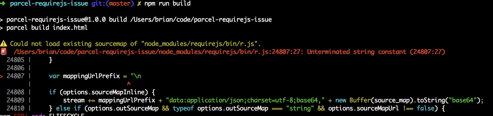

parcel-requirejs-issue
======================

Parcel seems to fail on lines that look like sourceMappingURL references.

In this case, those lines are present because requirejs is doing its own parsing
of sourceMappingURL.

## To Reproduce

clone this repo, and run:
```bash
npm install
npm run start # or, 'npm run build'
```

You should see an error like the following:



## Workaround

The only workaround I've found is pretty ugly: use [patch-package](https://www.npmjs.com/package/patch-package/v/3.3.5) to apply manual changes to the requirejs source code. The patch I'm using is included in this repo at [requirejs+2.3.6.patch](./requirejs+2.3.6.patch). You can see how I've broken up the pattern without changing the evaluated string.

```diff
-    var mappingUrlPrefix = "\n//# sourceMappingURL=";
+    var mappingUrlPrefix = "\n/" + "/# sourceMappingURL=";
```
